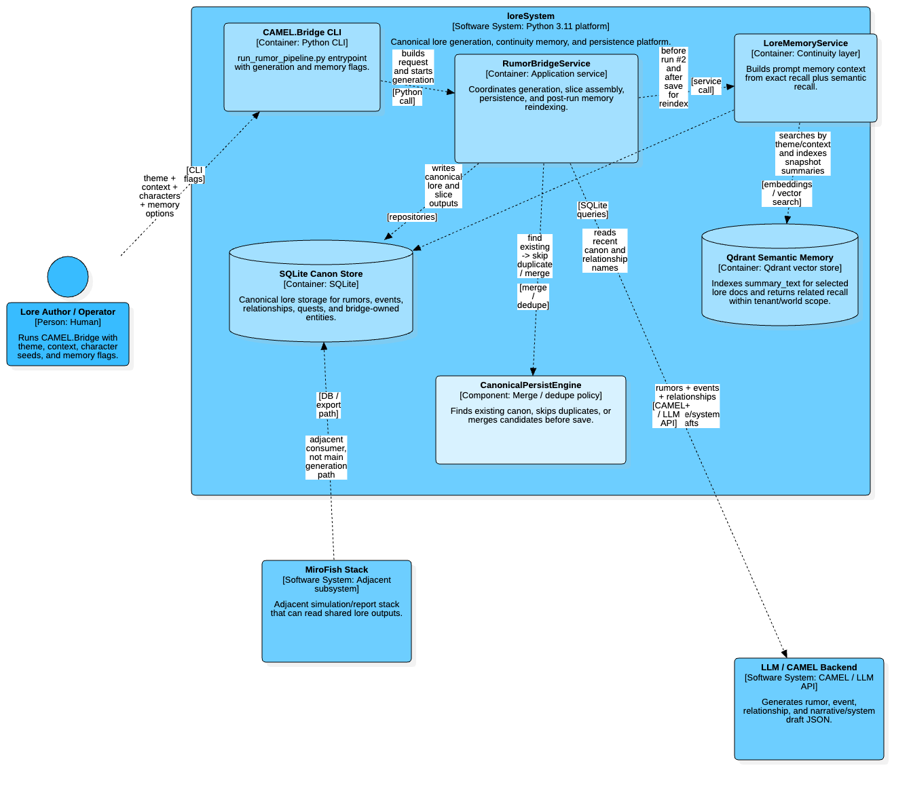

<p align="center">
  
  
  
  
  
  
</p>

# 🧶 MythWeave Chronicles

> Complete lore management system for AAA game development — 200+ entity types, AI-powered generation, persistence, and consistency validation.

**MythWeave** is a DDD-based framework for managing complex world lore. The primary active workflow is the **CAMEL.Bridge Rumor Pipeline**, which generates consistent game lore (rumors, characters, events, relationships, stories, and quests) directly into a SQLite database, backed by logical and domain validation scripts. The legacy multi-agent team JSON extraction system has been archived.

## 🔀 How this differs from `MiroFish` technically

This repository is the **canonical lore / world-model layer**. The embedded [`MiroFish/`](MiroFish/) project is a **simulation runtime + interactive report UI**.

> **Current recommendation:** for new lore generation, extraction, and structured entity write-back workflows, prefer **`CAMEL.Bridge/` in this repo** first. Use [`MiroFish/`](MiroFish/) only when you specifically need the simulation runtime, social-agent behavior, or the interactive report UI.

| Aspect | `loreSystem` (this repo) | `MiroFish/` subproject |
|--------|---------------------------|------------------------|
| Primary role | Structured lore extraction, validation, storage | Multi-agent social simulation, report generation, graph exploration |
| Backend style | Python-first DDD / repository architecture | Flask API orchestrating simulation and report workflows |
| Frontend | Optional local GUI (`PyQt6`) + CLI + MCP | Web frontend with `Vue 3` + `Vite` + `D3` |
| Core AI pattern | Claude Code agent teams + domain extraction skills | OASIS/CAMEL agent simulation + ReportAgent tool calling |
| Data layer | SQLite / SQLAlchemy / in-memory repositories / Elasticsearch | Zep Cloud + Cognee-style graph memory + runtime action logs |
| Package/runtime tooling | Poetry/pip-style Python workflow | Mixed `npm` + `uv` + Python backend workflow |

In short: **`loreSystem` compiles the world canon**, while **`MiroFish` simulates how actors behave inside that world**. They are complementary systems, not the same stack in different folders — and right now the **preferred default path is `CAMEL.Bridge/` inside `loreSystem`**, not the `MiroFish/` subproject.

## 🗺️ CAMEL.Bridge continuity architecture

This C4 diagram shows the preferred current generation path: `CAMEL.Bridge CLI` → `RumorBridgeService` → canonical SQLite persistence, optional Qdrant semantic memory, and canon-control via `CanonicalPersistEngine`.



## 🚀 CAMEL.Bridge Rumor Pipeline (Primary Workflow)

The **CAMEL.Bridge** pipeline is the core mechanism for generating, validating, and persisting game lore directly into the database. It automates the generation of rumors, characters, events, relationships, stories, and quests using AI (supporting OpenAI, Anthropic, or offline models via LM Studio).

### 🛠️ Execution

To run the primary rumor and lore generation pipeline:
```bash
python CAMEL.Bridge/run_rumor_pipeline.py --tenant-id 1 --world-id 1 --theme "Dark Fantasy" --count 5
```

For configuration options and parameters:
```bash
python CAMEL.Bridge/run_rumor_pipeline.py --help
```

For detailed documentation, configuration, and verification steps, see the [Lore Generation Pipeline Guide](docs/LORE_GENERATION_PIPELINE.md).

### 🔍 Logical Consistency Validation

Lore generation is backed by a powerful validation engine to prevent contradictions and ensure logical consistency:
```bash
python scripts/validate_lore.py --db-path lore_system.db --format table
```
This script validates:
- Character stats and attribute limits
- Mutual relationship symmetry (e.g. A likes B <=> B likes A)
- Quest objective dependencies and cycle detection
- Faction hierarchy and territorial integrity

Use the `--interactive` flag for a Russian terminal-based menu mode:
```bash
python scripts/validate_lore.py --interactive
```

---

## ✨ Key Features

| Feature | Description |
|---------|-------------|
| **200+ Entity Types** | 34 categories covering every aspect of AAA game design |
| **CAMEL.Bridge** | Primary pipeline for rumor, story, and quest generation directly to SQLite |
| **Validation Engine** | Logical consistency checks, relationship symmetry, cycle detection |
| **MCP Server** | Model Context Protocol server with 22 CRUD tools |
| **DDD Architecture** | Clean Domain → Application → Infrastructure layers |
| **Multi-tenant** | Run multiple game projects simultaneously |
| **Dual Storage** | In-Memory and SQLite backends, 100% repository coverage |

---

## 🚀 Quick Start

### Prerequisites

- Python 3.11+
- [Claude Code](https://code.claude.com) (optional, for archived agent team features)

### Installation

```bash
git clone https://github.com/bivex/loreSystem && cd loreSystem
python -m venv venv && source venv/bin/activate
pip install -r requirements.txt
make hooks-install
```

### 🐳 Run with Docker (Recommended Fast Path)

If you have Docker installed, you can start everything (including search and memory engines) with one command:

```bash
cp .env.example .env  # Add your API keys here
docker compose up -d
```

See [DOCKER.md](DOCKER.md) for full usage instructions and CLI commands.

### Run (Native)

```bash
# Main application
python main.py

# Run rumor generation (Primary AI pipeline)
python CAMEL.Bridge/run_rumor_pipeline.py --help

# Run lore validation (Primary consistency validation)
python scripts/validate_lore.py --help

# MCP server (standalone)
python lore_mcp_server/run_server.py

# CLI
python -m src --help

# Tests
python -m pytest tests/ -v
```

---

## 🤖 LM Studio & Local Models

**CAMEL.Bridge now works with local models via LM Studio!** No API keys required, fully offline generation.

### Setup LM Studio

1. Install [LM Studio](https://lmstudio.ai/)
2. Load a model (tested with `L3-8B-Stheno-v3.2-MLX`)
3. Start the server (default: `http://127.0.0.1:1234`)

### Run with Local Model

```bash
# Set environment for LM Studio
export CAMEL_MODEL_PLATFORM="OPENAI"
export CAMEL_MODEL_BASE_URL="http://127.0.0.1:1234"
export CAMEL_MODEL_TYPE="l3-8b-stheno-v3.2-mlx"
export CAMEL_MODEL_TEMPERATURE="0.8"

# Run CAMEL Bridge
python CAMEL.Bridge/run_rumor_pipeline.py \
  --tenant-id 1 \
  --world-id 1 \
  --theme "Dark Fantasy" \
  --output-language ru \
  --count 2 \
  --db-path "lore_local.db"
```

### Quick Test Scripts

```bash
# Test LM Studio connection
python3 scripts/test_lm_studio.py

# Generate quests with local model
python3 scripts/run_lm_studio.py --type quest --limit 3
```

**Note:** Local models are slower than cloud APIs (~8-10s per request) but offer:
- Zero API costs
- Full privacy (data never leaves your machine)
- Custom model fine-tuning
- Offline operation

---

<details>
<summary>📦 Архив: Legacy Agent Team System (JSON-экстракция)</summary>

## 🤖 Agent Team System

The core power of MythWeave was **AI-powered lore extraction** into JSON files using Claude Code agent teams.

> [!NOTE]
> This system is kept for backwards compatibility but is no longer the main workflow. Use the **CAMEL.Bridge Rumor Pipeline** instead.

### Architecture

```
┌─────────────────────────────────────────────────────┐
│                  extraction-lead                     │
│            (orchestrator, delegate mode)             │
├───────────┬───────────┬───────────┬────────┬────────┤
│ narrative │   world   │  society  │systems │  tech  │
│   team    │   team    │   team    │  team  │  team  │
├───────────┼───────────┼───────────┼────────┼────────┤
│ Stories   │ Geography │ Factions  │ Skills │ Cinema │
│ Characters│ Climate   │ Politics  │ Economy│ Audio  │
│ Quests    │ Cities    │ Religion  │ Items  │ VFX    │
│ Lore      │ Dungeons  │ History   │ Combat │ Travel │
└───────────┴───────────┴───────────┴────────┴────────┘
        ↓           ↓           ↓          ↓         ↓
  narrative.json world.json society.json systems.json technical.json
        └───────────┴─────┬─────┴──────────┴─────────┘
                          ↓
                   merged_lore.json
```

### Teams & Skills

| Team | Role | Skills | Output |
|------|------|--------|--------|
| **extraction-lead** | Orchestrate, merge, validate | `lore-extraction`, `entity-validator`, `json-formatter` | `entities/merged_lore.json` |
| **narrative-team** | Stories, characters, quests | `narrative-writing`, `character-design`, `quest-design`, `lore-writing` | `entities/narrative.json` |
| **world-team** | Geography, environments, cities | `world-building`, `environmental-design`, `urban-design` | `entities/world.json` |
| **society-team** | Factions, politics, religion, history | `faction-design`, `political-analysis`, `social-culture`, `religious-lore`, `historical-research` | `entities/society.json` |
| **systems-team** | Progression, economy, items, combat | `progression-design`, `economic-modeling`, `legendary-items`, + 6 more | `entities/systems.json` |
| **technical-team** | Cinematics, audio, VFX, transport | `cinematic-direction`, `audio-direction`, `vfx-design`, + 6 more | `entities/technical.json` |

### How to Use

**Full team extraction** (recommended for chapters / long text):

```
Create an agent team to extract lore from chapter_1.txt.
Use the extraction-lead agent for coordination.
Spawn all 5 domain teammates.
Use delegate mode so the lead only coordinates.
```

**Selective team** (for focused text):

```
Create an agent team for chapter_1.txt.
Use extraction-lead. Spawn only narrative-team and world-team.
```

**Single skill** (quick extraction, no team overhead):

```
/character-design chapter_1.txt
/world-building chapter_1.txt
```

### When to Use What

| Scenario | Approach |
|----------|----------|
| Full chapter (5+ pages) | Agent team with all 5 specialists |
| Character-focused scene | `/character-design` or narrative-team only |
| Battle description | narrative-team + systems-team |
| World/map description | world-team only |
| Quick entity check | Single skill (`/faction-design`, `/quest-design`, etc.) |

### Cross-Reference Protocol

When a teammate finds an entity belonging to another domain, they log a cross-reference:

```json
{
  "cross_references": [
    {
      "domain": "world-team",
      "entity_type": "location",
      "name": "Eldoria Village",
      "note": "Referenced as protagonist's hometown"
    }
  ]
}
```

The lead resolves all cross-references during the merge phase, connecting entities across domains.
</details>

---

## 📂 Project Structure

```
loreSystem/
├── src/                          # Main application (DDD)
│   ├── domain/                   #   Entities, value objects, repo interfaces
│   ├── application/              #   Use cases, services
│   ├── infrastructure/           #   SQLite, InMemory implementations
│   └── presentation/             #   CLI, API
│
├── lore_mcp_server/              # Standalone MCP server
│   ├── mcp_server/server.py      #   22 MCP tools
│   └── lore_data/                #   Persistent JSON storage
│
├── CAMEL.Bridge/                 # Preferred current AI bridge for lore generation/write-back
│   └── run_rumor_pipeline.py     #   Live rumor -> narrative -> quest bridge CLI
│
├── .claude/
│   ├── agents/                   # 6 team agent definitions
│   │   ├── extraction-lead.md    #   Orchestrator
│   │   ├── narrative-team.md     #   Stories, characters, quests
│   │   ├── world-team.md         #   Geography, environments
│   │   ├── society-team.md       #   Factions, politics, religion
│   │   ├── systems-team.md       #   Progression, economy, items
│   │   └── technical-team.md     #   Cinema, audio, VFX
│   ├── skills/                   # 33 domain extraction skills
│   └── settings.json             # Agent teams + permissions
│
├── entities/                     # Extracted entity output (JSON)
├── examples/                     # Sample lore JSON files
├── tests/                        # Test suite (unit, integration, e2e)
├── docs/                         # Full documentation
├── CLAUDE.md                     # Project context for AI agents
└── AGENTS.md                     # Agent workflow documentation
```

---

## 🏛️ Architecture

### Domain-Driven Design

```
┌──────────────────────────────────────────┐
│              Presentation                │
│          (CLI, API, MCP Server)          │
├──────────────────────────────────────────┤
│              Application                 │
│        (Services, Use Cases, DTOs)       │
├──────────────────────────────────────────┤
│                Domain                    │
│  (Entities, Value Objects, Repo Interfaces)│
├──────────────────────────────────────────┤
│             Infrastructure               │
│    (SQLite, InMemory, Elasticsearch)     │
└──────────────────────────────────────────┘
```

### Repository Status — 100% Coverage (18/18)

All repository interfaces are fully implemented with In-Memory + SQLite backends.

<details>
<summary><b>Core Lore System (4)</b></summary>

- **WorldRepository** — Create/list/delete worlds
- **CharacterRepository** — Manage characters within worlds
- **StoryRepository** — Create and organize stories
- **PageRepository** — Manage content pages

</details>

<details>
<summary><b>World Building (3)</b></summary>

- **ItemRepository** — Items and inventory
- **LocationRepository** — World locations and areas
- **EnvironmentRepository** — Time, weather, lighting

</details>

<details>
<summary><b>Game Mechanics (8)</b></summary>

- **SessionRepository** — Active game sessions
- **ChoiceRepository** — Interactive story choices
- **FlowchartRepository** — Story branching
- **HandoutRepository** — Player documents
- **ImageRepository** — Asset management
- **InspirationRepository** — Creative prompts
- **MapRepository** — Game maps
- **TokenboardRepository** — Combat boards

</details>

<details>
<summary><b>Content Organization (3)</b></summary>

- **TagRepository** — Tag-based organization
- **NoteRepository** — GM notes and annotations
- **TemplateRepository** — Reusable templates

</details>

> **Note:** Only these 18 entities have repository interfaces and are accessible via the MCP server. The remaining 200+ domain entities exist in the domain model — their business logic is handled within other entities.

---

## 🌍 Domain Model — 200+ Entities across 34 Categories

<details>
<summary><b>Core Game Systems (50 entities)</b></summary>

| Category | Count | Entities |
|----------|-------|----------|
| Campaign & Story | 17 | Act, Chapter, Episode, Prologue, Epilogue, PlotBranch, Consequence, Ending, AlternateReality |
| Characters | 9 | CharacterEvolution, CharacterVariant, CharacterProfileEntry, MotionCapture, VoiceActor |
| Quests | 7 | QuestChain, QuestNode, QuestPrerequisite, QuestObjective, QuestTracker, QuestGiver |
| Skills & Progression | 8 | Skill, Perk, Trait, Attribute, Experience, LevelUp, TalentTree, Mastery |
| Inventory & Crafting | 9 | Inventory, CraftingRecipe, Material, Component, Blueprint, Enchantment, Socket, Rune, Glyph |

</details>

<details>
<summary><b>World Building (39 entities)</b></summary>

| Category | Count | Entities |
|----------|-------|----------|
| Locations | 10 | HubArea, Instance, Dungeon, Raid, Arena, OpenWorldZone, Underground, Skybox, Dimension, PocketDimension |
| Politics & History | 14 | Era, EraTransition, Timeline, Calendar, Holiday, Season, TimePeriod, Treaty, Constitution, Law, LegalSystem, Nation, Kingdom, Empire |
| Economy | 8 | Trade, Barter, Tax, Tariff, Supply, Demand, Price, Inflation |
| Military | 7 | Army, Fleet, WeaponSystem, Defense, Fortification, SiegeEngine, Battalion |

</details>

<details>
<summary><b>Social Systems (22 entities)</b></summary>

| Category | Count | Entities |
|----------|-------|----------|
| Social Relations | 7 | Reputation, Affinity, Disposition, Honor, Karma, SocialClass, SocialMobility |
| Factions | 5 | FactionHierarchy, FactionIdeology, FactionLeader, FactionResource, FactionTerritory |
| Religion & Mysticism | 10 | Cult, Sect, HolySite, Scripture, Ritual, Oath, Summon, Pact, Curse, Blessing |

</details>

<details>
<summary><b>Content & Creativity (25 entities)</b></summary>

| Category | Count | Entities |
|----------|-------|----------|
| Lore System | 8 | LoreFragment, CodexEntry, JournalPage, BestiaryEntry, Memory, Dream, Nightmare, SecretArea |
| Music & Audio | 8 | Theme, Motif, Score, Soundtrack, VoiceLine, SoundEffect, Ambient, Silence |
| Visual Effects | 5 | VisualEffect, Particle, Shader, Lighting, ColorPalette |
| Cinematography | 6 | Cutscene, Cinematic, CameraPath, Transition, Fade, Flashback |

</details>

<details>
<summary><b>Advanced Systems (29 entities)</b></summary>

| Category | Count | Entities |
|----------|-------|----------|
| Architecture | 8 | District, Ward, Quarter, Plaza, MarketSquare, Slums, NobleDistrict, PortDistrict |
| Biology & Ecology | 6 | FoodChain, Migration, Hibernation, Reproduction, Extinction, Evolution |
| Astronomy | 10 | Galaxy, Nebula, BlackHole, Wormhole, StarSystem, Moon, Eclipse, Solstice |
| Weather & Climate | 5 | WeatherPattern, Cataclysm, Disaster, Miracle, Atmosphere |

</details>

<details>
<summary><b>Gameplay, UGC & Analytics (50+ entities)</b></summary>

| Category | Count | Entities |
|----------|-------|----------|
| Narrative Devices | 6 | PlotDevice, DeusExMachina, ChekhovsGun, Foreshadowing, FlashForward, RedHerring |
| Global Events | 7 | WorldEvent, SeasonalEvent, Invasion, Plague, Famine, War, Revolution |
| Travel | 6 | FastTravelPoint, Waypoint, SavePoint, Checkpoint, Autosave, SpawnPoint |
| Achievements | 6 | Achievement, Trophy, Badge, Title, Rank, Leaderboard |
| Legendary Items | 6 | LegendaryWeapon, MythicalArmor, DivineItem, CursedItem, ArtifactSet, RelicCollection |
| Transport | 9 | Pet, Mount, Familiar, MountEquipment, Vehicle, Spaceship, Airship, Portal, Teleporter |
| UGC | 5 | Mod, CustomMap, UserScenario, ShareCode, WorkshopEntry |
| Localization | 5 | Localization, Translation, VoiceOver, Subtitle, Dubbing |
| Analytics | 8 | PlayerMetric, SessionData, Heatmap, DropRate, ConversionRate, DifficultyCurve, LootTableWeight, BalanceEntities |
| Institutions | 7 | Academy, University, School, Library, ResearchCenter, Archive, Museum |
| Media | 7 | Newspaper, Radio, Television, Internet, SocialMedia, Propaganda, Rumor |
| Secrets | 8 | SecretArea, HiddenPath, EasterEgg, Mystery, Enigma, Riddle, Puzzle, Trap |

</details>

---

## 🔧 33 Extraction Skills

All skills live in `.claude/skills/` with YAML frontmatter for auto-discovery by Claude Code.

<details>
<summary><b>Domain Skills (30) — auto-invoked by Claude when relevant</b></summary>

| Skill | Entities | Team |
|-------|----------|------|
| `narrative-writing` | Story, Chapter, Act, Episode, PlotBranch | narrative |
| `character-design` | Character, Relationships, Evolution, Variants | narrative |
| `quest-design` | Quest, QuestChain, Objectives, MoralChoice | narrative |
| `lore-writing` | LoreFragment, Codex, Bestiary, Dreams | narrative |
| `world-building` | Location, Dungeon, Arena, Dimension | world |
| `environmental-design` | Weather, Atmosphere, Lighting, Disasters | world |
| `urban-design` | District, Ward, Market, Plaza | world |
| `faction-design` | Faction, Hierarchy, Territory, Ideology | society |
| `political-analysis` | Government, Law, Court, Treaty | society |
| `social-culture` | SocialClass, Honor, Karma, Festival | society |
| `religious-lore` | Cult, Ritual, Blessing, Curse, Scripture | society |
| `historical-research` | Era, Timeline, Calendar, Ceremony | society |
| `progression-design` | Skill, Perk, Trait, TalentTree, XP | systems |
| `economic-modeling` | Trade, Currency, Shop, Supply/Demand | systems |
| `legendary-items` | Artifacts, Runes, Enchantments, Relics | systems |
| `achievement-design` | Trophy, Badge, Rank, Leaderboard | systems |
| `puzzle-design` | Puzzle, Riddle, Trap, EasterEgg | systems |
| `military-strategy` | Army, Fleet, Fortification, War | systems |
| `biology-design` | Ecosystem, FoodChain, Evolution | systems |
| `celestial-science` | Galaxy, Star, BlackHole, Eclipse | systems |
| `analytics-balance` | DropRate, DifficultyCurve, LootTable | systems |
| `cinematic-direction` | Cutscene, CameraPath, Flashback | technical |
| `audio-direction` | Music, SoundEffect, Motif, Ambient | technical |
| `vfx-design` | Particle, Shader, Lighting, ColorPalette | technical |
| `transport-design` | Mount, Vehicle, Portal, Airship | technical |
| `content-management` | Mod, Localization, UGC, Workshop | technical |
| `media-analysis` | Newspaper, Radio, Propaganda, Rumor | technical |
| `research-design` | Academy, Library, Archive, Museum | technical |
| `ui-design` | Choice, Flowchart, Handout, Tag | technical |
| `technical-systems` | 193 catch-all entity types (safety net) | technical |

</details>

<details>
<summary><b>Base Skills (3) — background knowledge, auto-loaded</b></summary>

| Skill | Purpose |
|-------|---------|
| `lore-extraction` | Base extraction rules for all agents |
| `entity-validator` | Type checking, required fields, deduplication |
| `json-formatter` | Strict JSON output, UUID generation, schema compliance |

</details>

---

## 🔌 MCP Server

The MCP server exposes 22 tools for lore CRUD operations:

```bash
python lore_mcp_server/run_server.py
```

Connect from Claude Code, Claude Desktop, or any MCP client. See [MCP Server docs](lore_mcp_server/docs/) for the full API reference.

---

## 📖 Documentation

| Document | Description |
|----------|-------------|
| [User Guide](docs/USER_GUIDE.md) | Installation and usage |
| [Documentation Index](docs/README.md) | Full docs navigation |
| [Design & Implementation](docs/design/) | Architecture decisions, ADRs |
| [Validation & Verification](docs/validation/) | Test reports, edge cases |
| [Feature Guides](docs/features/) | Detailed feature docs |
| [CLI Quick Reference](docs/CLI_QUICK_REF.md) | Command-line usage |
| [MCP Server Docs](lore_mcp_server/docs/) | MCP API reference |
| [Gacha Mechanics](docs/GACHA_MECHANICS.md) | Gacha system design |

---

## � Community Standards

This project follows recommended community standards for open-source development:

| Standard | Status | Description |
|----------|--------|-------------|
| **README** | ✅ | Comprehensive project documentation |
| **Code of Conduct** | ✅ [📄](CODE_OF_CONDUCT.md) | Community guidelines and expectations |
| **Contributing** | ✅ [📝](CONTRIBUTING.md) | How to contribute to the project |
| **License** | ✅ [📜](LICENSE) | Project licensing information |
| **Security Policy** | ✅ [🔒](SECURITY.md) | Security vulnerability reporting |
| **Issue Templates** | ✅ [📋](.github/ISSUE_TEMPLATE/) | Standardized issue reporting |
| **Pull Request Template** | ✅ [🔄](.github/PULL_REQUEST_TEMPLATE.md) | Standardized PR submissions |

---

## �🧪 Testing

```bash
# Full test suite with coverage
python -m pytest tests/ -v --cov=src --cov-report=html

# By marker
python -m pytest tests/ -m unit          # Fast, no I/O
python -m pytest tests/ -m integration   # Database tests
python -m pytest tests/ -m e2e           # Full system
```

---

## 🛠️ Tech Stack

| Layer | Technologies |
|-------|-------------|
| **Language** | Python 3.11+ |
| **Architecture** | DDD, Hexagonal, Repository Pattern |
| **Storage** | SQLite, SQLAlchemy, In-Memory |
| **Validation** | Pydantic 2.x |
| **CLI** | Click, Rich |
| **GUI** | PyQt6 |
| **Search** | Elasticsearch |
| **Config** | PyYAML, python-dotenv |
| **DI** | dependency-injector |
| **AI** | Claude Code Agent Teams, CAMEL Bridge, 33 Skills, MCP Server |
| **Testing** | pytest, pytest-cov |

---

## 🧭 Which path should I use right now?

### Prefer `CAMEL.Bridge/` when you want

- structured lore generation directly into SQLite
- deterministic bridge-owned persistence and smoke testing
- fast iteration on rumor / event / character / quest / story entity generation
- the current actively preferred workflow in this repository

### Use `MiroFish/` when you specifically need

- social simulation runs
- report generation over runtime/simulation evidence
- the web UI / graph exploration flow
- experimentation with the simulation subproject itself

### Practical rule of thumb

If you're deciding where to start **today**, start with:

```bash
python CAMEL.Bridge/run_rumor_pipeline.py --help
```

Reach for `MiroFish/` only if the task is explicitly about simulation or report UX rather than canonical lore generation.

---

<p align="center">
  <b>MythWeave Chronicles</b> — built for game developers who take their lore seriously.
</p>
