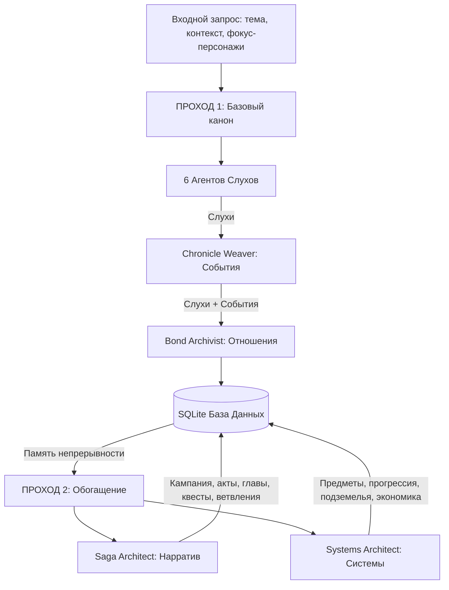

# Двухпроходный конвейер генерации лора (Lore Generation Pipeline)

Этот документ описывает устройство и логику работы системы генерации лора в **MythWeave Chronicles** через конвейер `RumorBridgeService`.

---

## Архитектура конвейера (Высокоуровневая схема)

Генерация происходит в два основных прохода (шага). Первый проход создает базовые факты мира (канон), а второй проход разворачивает их в структуру игры и геймплейные механики.



---

## Первый проход: Генерация базового канона (Core Pass)

Цель первого прохода — создать «сырой» фактологический фундамент мира, на который будут опираться все последующие сценарии и механики.

### 1. Генерация слухов (Rumors)
Система запускает **6 параллельных ИИ-агентов** с разными ролями, чтобы получить разнообразные слухи об одной теме:
1.  **Whisper Broker** — генерирует грязные, неподтвержденные уличные слухи.
2.  **Town Crier** — придумывает громкие, публичные новости, подходящие для глашатаев.
3.  **Dockside Informant** — фокусируется на контрабанде, грузах и тайнах у воды.
4.  **Rooftop Scavenger** — отвечает за высокие уровни (киберпанк-высоты, слежка, хакерство).
5.  **Night Market Vendor** — генерирует слухи о подпольной торговле и запрещенных технологиях.
6.  **Cyber-Clinic Healer** — описывает слухи о подпольных имплантах и медицинских экспериментах.

### 2. Резолв персонажей
Система проверяет имена персонажей, фигурирующие в запросе и слухах.
*   Если персонаж уже существует в БД для данного мира, он загружается.
*   Если персонажа нет, генерируется его автобиография и базовые характеристики (HP, ATK, DEF, Speed), и он сохраняется в БД.

### 3. Синтез событий (Events)
Агент **Chronicle Weaver** анализирует сгенерированные слухи и собирает их в единое логическое событие (Event):
*   Формирует название и описание события.
*   Связывает участников (персонажей) с событием.
*   Определяет статус исхода (например, `ongoing`, `resolved`, `mixed`).

### 4. Синтез отношений (Relationships)
Агент **Bond Archivist** анализирует слухи и события и выводит социальные связи между персонажами:
*   Определяет тип связи (`ally`, `enemy`, `complicated` и др.).
*   Рассчитывает уровень отношений (от -100 до 100).
*   Связывает отношение с событием, при котором персонажи впервые встретились или проявили себя.

---

## Второй проход: Обогащение (Enrichment Pass)

На втором проходе базовый канон из БД вычитывается и передается в LLM для разворачивания в полноценную игру. Этот проход управляется флагами `include_narrative_structure` и `include_systems_slice`.

### Часть А. Повествовательная структура (Saga Architect)
Если включен нарратив, конвейер генерирует контент в четыре последовательных пакета (Batches):

| Пакет (Batch) | Генерируемые сущности | Логика генерации |
| :--- | :--- | :--- |
| **`story_spine`** | Кампания, История, Акты, Главы, Эпизоды, Сюжетные линии | Выстраивает хронологическую цепочку прохождения игры на основе событий первого прохода. |
| **`character_meta`** | Эволюция персонажей, Варианты, Анкеты, Данные озвучки/MoCap | Расписывает, как персонажи меняются по ходу сюжета и какие технические ассеты для них нужны. |
| **`quest_meta`** | Квесты, Квестовые цепочки, Цели, Пререквизиты, Награды | Проектирует реальные игровые задания с внятным описанием целей для журнала игрока. |
| **`narrative_branching`** | Ветвления, Выборы, Последствия, Моральный выбор, Концовки | Описывает нелинейные развилки сюжета и то, к каким финалам приводят решения игрока. |

### Часть Б. Системный срез (Systems Architect)
Если включены системы, конвейер связывает художественный лор с числовыми игровыми механиками:

| Пакет (Batch) | Генерируемые сущности | Логика генерации |
| :--- | :--- | :--- |
| **`economy_items`** | Предметы, Инвентари, Ресурсы, Рецепты крафта, Чертежи, Руны | Создает физические предметы, которыми оперирует игрок (например, проклятая монета из слухов становится реальным `cursed_item`). |
| **`progression_meta`** | Навыки, Перки, Черты, Деревья талантов, Достижения | Создает способности и пассивные эффекты, отражающие лорную специфику персонажей. |
| **`content_zones`** | Подземелья, Рейды, Мировые события, Арены, Зоны открытого мира | Превращает упомянутые локации в игровые зоны со своими сценариями и боссами. |
| **`legendary_content`** | Легендарное оружие, Мифическая броня, Коллекции реликвий | Генерирует уникальные высокоуровневые артефакты с глубоким лором. |

---

## Память непрерывности (Continuity Memory)

Чтобы ИИ не придумывал факты, противоречащие уже созданным, используется `SQLiteLoreMemoryReader`. Перед каждым запросом к ИИ система собирает контекст непрерывности:
1.  **Точные совпадения**: Из БД выгружаются последние записи о фокусных персонажах, их текущих отношениях, активных слухах и событиях.
2.  **Семантический поиск**: Через векторный индекс (Qdrant) и эмбеддинги (`LocalNgramTextEmbedder`) ищутся лорные документы, наиболее близкие по смыслу к текущей теме.
3.  **Сборка промпта**: Все данные упаковываются в секцию `Continuity memory:` системного промпта:
    ```text
    Continuity memory:
    Theme anchor: [Тема]
    Focus characters: [Персонажи]
    Character-linked canon:
    - [Данные отношений и персонажей]
    World-state canon:
    - [События и слухи]
    ```

---

## Стабилизация данных и отказоустойчивость (Fallbacks)

1.  **Парсинг JSON**: Ответы ИИ оборачиваются в строгие JSON-схемы. Система использует регулярные выражения для поиска и очистки JSON-блоков в ответах LLM.
2.  **Валидация ссылок (Stabilization)**: Метод `_stabilize_narrative_structure_draft` проверяет, чтобы все ID квестов, актов и персонажей ссылались на реально существующие в БД сущности.
3.  **Резервные копии (Fallbacks)**: Если LLM ломается, возвращает некорректный JSON или превышает таймаут, система:
    *   При `allow_fallback = True` автоматически генерирует дефолтные сущности на основе шаблонов (например, создает дефолтный квест *"Событие в Гавани"*), чтобы конвейер не падал и продолжал работу.
    *   При `allow_fallback = False` генерирует исключение `RuntimeError` для прерывания процесса.
