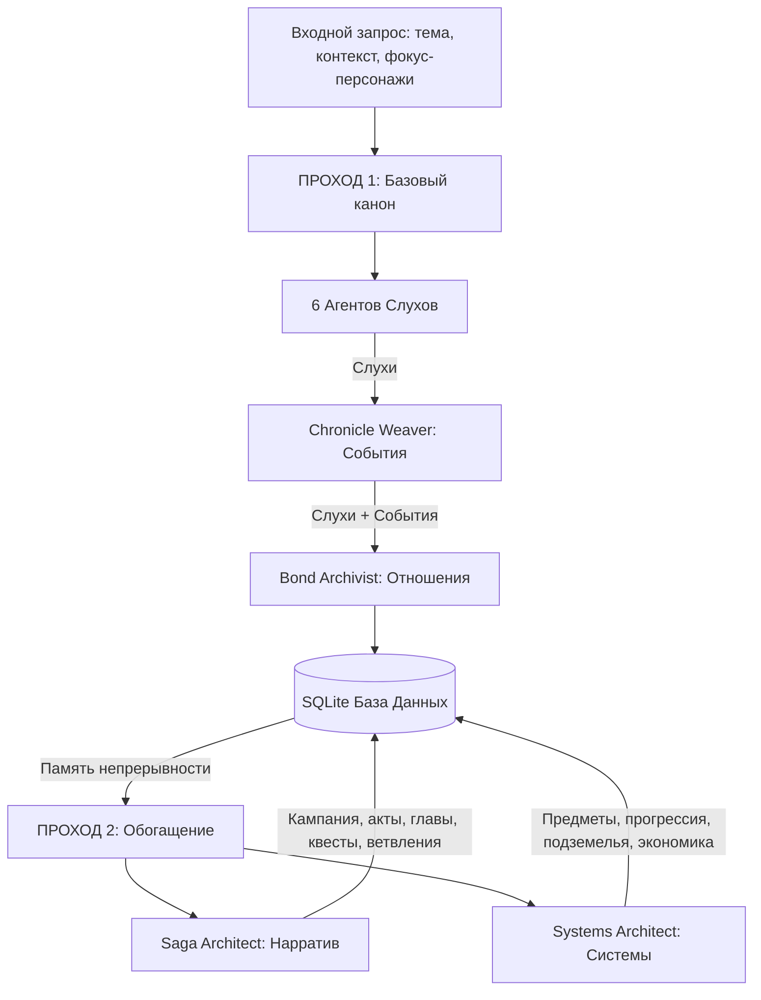

# Двухпроходный конвейер генерации лора (Lore Generation Pipeline)

Этот документ описывает устройство и логику работы системы генерации лора в **MythWeave Chronicles** через конвейер `RumorBridgeService`.

---

## Архитектура конвейера (Высокоуровневая схема)

Генерация происходит в два основных прохода (шага). Первый проход создает базовые факты мира (канон), а второй проход разворачивает их в структуру игры и геймплейные механики.



---

## Первый проход: Генерация базового канона (Core Pass)

Цель первого прохода — создать «сырой» фактологический фундамент мира, на который будут опираться все последующие сценарии и механики.

### 1. Генерация слухов (Rumors)
Система запускает **6 параллельных ИИ-агентов** с разными ролями, чтобы получить разнообразные слухи об одной теме:
1.  **Whisper Broker** — генерирует грязные, неподтвержденные уличные слухи.
2.  **Town Crier** — придумывает громкие, публичные новости, подходящие для глашатаев.
3.  **Dockside Informant** — фокусируется на контрабанде, грузах и тайнах у воды.
4.  **Rooftop Scavenger** — отвечает за высокие уровни (киберпанк-высоты, слежка, хакерство).
5.  **Night Market Vendor** — генерирует слухи о подпольной торговле и запрещенных технологиях.
6.  **Cyber-Clinic Healer** — описывает слухи о подпольных имплантах и медицинских экспериментах.

### 2. Резолв персонажей
Система проверяет имена персонажей, фигурирующие в запросе и слухах.
*   Если персонаж уже существует в БД для данного мира, он загружается.
*   Если персонажа нет, генерируется его автобиография и базовые характеристики (HP, ATK, DEF, Speed), и он сохраняется в БД.

### 3. Синтез событий (Events)
Агент **Chronicle Weaver** анализирует сгенерированные слухи и собирает их в единое логическое событие (Event):
*   Формирует название и описание события.
*   Связывает участников (персонажей) с событием.
*   Определяет статус исхода (например, `ongoing`, `resolved`, `mixed`).

### 4. Синтез отношений (Relationships)
Агент **Bond Archivist** анализирует слухи и события и выводит социальные связи между персонажами:
*   Определяет тип связи (`ally`, `enemy`, `complicated` и др.).
*   Рассчитывает уровень отношений (от -100 до 100).
*   Связывает отношение с событием, при котором персонажи впервые встретились или проявили себя.

---

## Второй проход: Обогащение (Enrichment Pass)

На втором проходе базовый канон из БД вычитывается и передается в LLM для разворачивания в полноценную игру. Этот проход управляется флагами `include_narrative_structure` и `include_systems_slice`.

### Часть А. Повествовательная структура (Saga Architect)
Если включен нарратив, конвейер генерирует контент в четыре последовательных пакета (Batches):

| Пакет (Batch) | Генерируемые сущности | Логика генерации |
| :--- | :--- | :--- |
| **`story_spine`** | Кампания, История, Акты, Главы, Эпизоды, Сюжетные линии | Выстраивает хронологическую цепочку прохождения игры на основе событий первого прохода. |
| **`character_meta`** | Эволюция персонажей, Варианты, Анкеты, Данные озвучки/MoCap | Расписывает, как персонажи меняются по ходу сюжета и какие технические ассеты для них нужны. |
| **`quest_meta`** | Квесты, Квестовые цепочки, Цели, Пререквизиты, Награды | Проектирует реальные игровые задания с внятным описанием целей для журнала игрока. |
| **`narrative_branching`** | Ветвления, Выборы, Последствия, Моральный выбор, Концовки | Описывает нелинейные развилки сюжета и то, к каким финалам приводят решения игрока. |

### Часть Б. Системный срез (Systems Architect)
Если включены системы, конвейер связывает художественный лор с числовыми игровыми механиками:

| Пакет (Batch) | Генерируемые сущности | Логика генерации |
| :--- | :--- | :--- |
| **`economy_items`** | Предметы, Инвентари, Ресурсы, Рецепты крафта, Чертежи, Руны | Создает физические предметы, которыми оперирует игрок (например, проклятая монета из слухов становится реальным `cursed_item`). |
| **`progression_meta`** | Навыки, Перки, Черты, Деревья талантов, Достижения | Создает способности и пассивные эффекты, отражающие лорную специфику персонажей. |
| **`content_zones`** | Подземелья, Рейды, Мировые события, Арены, Зоны открытого мира | Превращает упомянутые локации в игровые зоны со своими сценариями и боссами. |
| **`legendary_content`** | Легендарное оружие, Мифическая броня, Коллекции реликвий | Генерирует уникальные высокоуровневые артефакты с глубоким лором. |

---

## Память непрерывности (Continuity Memory)

Чтобы ИИ не придумывал факты, противоречащие уже созданным, используется `SQLiteLoreMemoryReader`. Перед каждым запросом к ИИ система собирает контекст непрерывности:
1.  **Точные совпадения**: Из БД выгружаются последние записи о фокусных персонажах, их текущих отношениях, активных слухах и событиях.
2.  **Семантический поиск**: Через векторный индекс (Qdrant) и эмбеддинги (`LocalNgramTextEmbedder`) ищутся лорные документы, наиболее близкие по смыслу к текущей теме.
3.  **Сборка промпта**: Все данные упаковываются в секцию `Continuity memory:` системного промпта:
    ```text
    Continuity memory:
    Theme anchor: [Тема]
    Focus characters: [Персонажи]
    Character-linked canon:
    - [Данные отношений и персонажей]
    World-state canon:
    - [События и слухи]
    ```

---

## Стабилизация данных и отказоустойчивость (Fallbacks)

1.  **Парсинг JSON**: Ответы ИИ оборачиваются в строгие JSON-схемы. Система использует регулярные выражения для поиска и очистки JSON-блоков в ответах LLM.
2.  **Валидация ссылок (Stabilization)**: Метод `_stabilize_narrative_structure_draft` проверяет, чтобы все ID квестов, актов и персонажей ссылались на реально существующие в БД сущности.
3.  **Резервные копии (Fallbacks)**: Если LLM ломается, возвращает некорректный JSON или превышает таймаут, система:
    *   При `allow_fallback = True` автоматически генерирует дефолтные сущности на основе шаблонов (например, создает дефолтный квест *"Событие в Гавани"*), чтобы конвейер не падал и продолжал работу.
    *   При `allow_fallback = False` генерирует исключение `RuntimeError` для прерывания процесса.

---

## Запуск первого прохода (Core Pass) с памятью Qdrant

Для обеспечения непрерывности контекста генерации (Continuity Memory) через векторную БД Qdrant выполните следующие шаги:

### 1. Запуск контейнера Qdrant
Убедитесь, что Qdrant запущен и слушает порт `6333`:
```bash
docker-compose up -d qdrant
```

### 2. Настройка окружения (`.env`)
Добавьте в ваш `.env` файл переменные для подключения к Qdrant:
```ini
# Параметры подключения к векторной БД
CAMEL_MEMORY_QDRANT_URL=http://localhost:6333
CAMEL_MEMORY_EMBED_BACKEND=local
CAMEL_MEMORY_EMBED_DIMENSION=384
CAMEL_MEMORY_QDRANT_COLLECTION=camel_bridge_memory
```

### 3. Запуск команды генерации
Используйте флаг `--with-memory` для активации Qdrant-памяти. Не указывайте `--with-campaign-story` и `--with-systems`, чтобы запустить только первый проход (Core Pass):

```bash
CAMEL_MEMORY_QDRANT_URL=http://localhost:6333 \
./venv/bin/python3 CAMEL.Bridge/run_rumor_pipeline.py \
  --tenant-id 1 \
  --world-id 1 \
  --theme "Темные фэнтези силы" \
  --context "Древние культы призывают силы тьмы." \
  --count 1 \
  --db-path lore_system.db \
  --output-language ru \
  --env-file .env \
  --with-memory
```

---

## Верификация работы памяти (Пример из практики)

Ниже приведен практический сценарий для подтверждения работоспособности векторной памяти:

### Шаг 1: Очистка БД и чистый запуск (Core Pass + Narrative Pass)
Сначала база данных полностью очищается:
```python
# python -c "import sqlite3; conn=sqlite3.connect('lore_system.db'); cur=conn.cursor(); ... (очистка таблиц)"
```
Затем запускаются 2 прохода с сохранением канона в Qdrant:
```bash
CAMEL_MEMORY_QDRANT_URL=http://localhost:6333 ./venv/bin/python3 CAMEL.Bridge/run_rumor_pipeline.py \
  --tenant-id 1 --world-id 1 --theme "Темные фэнтези силы" \
  --context "Древние культы призывают силы тьмы." --count 1 \
  --db-path lore_system.db --output-language ru --env-file .env --with-memory --with-campaign-story
```
*На данном этапе лог запуска показывает `memory_chars=0`, так как база данных пуста.*

### Шаг 2: Проверка извлечения контекста (Core Pass на связанных данных)
Запускается генерация продолжения истории (без очистки БД):
```bash
CAMEL_MEMORY_QDRANT_URL=http://localhost:6333 ./venv/bin/python3 CAMEL.Bridge/run_rumor_pipeline.py \
  --tenant-id 1 --world-id 1 --theme "Последствия ритуала в гавани" \
  --context "Ивен Хейл пытается помочь Маре Восс справиться с проклятием тлеющего пепла, пока городские стражники ищут скрывающихся культистов." \
  --count 1 --db-path lore_system.db --output-language ru --env-file .env --with-memory
```

### Шаг 3: Результат логирования
Логи подтверждают, что конвейер считал контекст из Qdrant и SQLite:
```text
2026-06-18 16:43:56,929 INFO CAMEL bridge story chain start tenant_id=1 world_id=1 narrative=False systems=False memory_chars=940
...
2026-06-18 16:44:38,315 INFO CAMEL bridge memory indexed documents=10 tenant_id=1 world_id=1
```
* `memory_chars=940` означает, что LLM перед началом генерации получила 940 символов связанных канонических данных (персонажей, прошлых событий и слухов).
* Новый слух логически сослался на сущности прошлых проходов: *«Черный пепел в гавани шепчет о новых угрозах»* (притягивающий «теневых стражей», созданных во 2-м проходе).

---

## Рекомендуемый рабочий процесс (Best Practice Workflow)

Для построения глубокого, связного и логически непротиворечивого игрового мира рекомендуется использовать двухэтапный рабочий процесс:

### Этап 1: Инициализация фундамента мира (Глобальный проход)
Создается базовая структура мира, ключевые исторические факты и стартовые механики.

* **Параметры запуска**: С памятью Qdrant, нарративной структурой и системным срезом.
* **Флаги**: `--with-memory --with-campaign-story --with-systems`
* **Цель**: Заселить мир базовыми персонажами, создать глобальные квесты, зоны, предметы и навыки. Эти сущности автоматически проиндексируются и станут каноном.

### Этап 2: Итеративное расширение мира (Инкрементальное развитие)
Мир точечно наполняется новыми событиями, побочными сюжетами и деталями без пересоздания глобального канона.

* **Параметры запуска**: С памятью Qdrant, но без перегенерации глобальной кампании/систем (только Core Pass).
* **Флаги**: `--with-memory` (флаги `--with-campaign-story` и `--with-systems` исключены).
* **Схема работы**:
  1. Вы формулируете локальную тему (например: *"Появление теневых монстров в гавани в результате ритуала"*).
  2. Запускаете генерацию.
  3. Qdrant-память извлекает релевантных персонажей (например, *Mara Voss*), их болезни и прошлые события.
  4. ИИ связывает новый слух или событие с уже существующими персонажами и фактами, органично развивая вселенную.

#### Преимущества такого подхода:
* **Качество и детализация**: Модель фокусируется на небольшом объеме новых сущностей, не перегружая контекстное окно.
* **Логическая связность**: Персонажи помнят свои прошлые действия, болезни и статус отношений.
* **Динамичность**: Возможность развивать мир эпизод за эпизодом, подобно настольной ролевой игре.

---

## Исправление доменных ограничений (Bugfix: CursedItem Invariants)

Во время полной генерации (Full Pass) ИИ может возвращать значения редкости (`rarity`) или степени риска (`risk_level`) проклятых предметов, выходящие за рамки строгих валидаторов домена `CursedItem`:
* `VALID_CURSED_ITEM_RARITIES = {"rare", "epic", "legendary", "cursed", "forbidden"}`
* `VALID_CURSED_ITEM_RISKS = {"low", "medium", "high", "extreme"}`

### Решение
В класс `CoerceParserMixin` (файл [parsers_coerce_utils.py](file:///Volumes/External/Code/loreSystem/src/application/integration/camel_bridge/mixins/parsers_coerce_utils.py)) добавлены следующие хэндлеры коэрции:
1. `_coerce_cursed_item_rarity(value)`: Маппит нестандартные значения (например, `mythical` $\to$ `legendary`, `common` $\to$ `rare`) в допустимый список, дефолт — `cursed`.
2. `_coerce_cursed_item_risk(value)`: Маппит синонимы (например, `moderate` $\to$ `medium`, `critical` $\to$ `extreme`), дефолт — `high`.

Методы применены в [parsers_items.py](file:///Volumes/External/Code/loreSystem/src/application/integration/camel_bridge/mixins/parsers_items.py) при сборке объекта `CursedItemDraft`. Это гарантирует отсутствие прерываний выполнения из-за `InvariantViolation`.

---

## Верификация Full Pass (Сюжет + Системы)

Для запуска полного прохода инициализации (Core + Narrative + Systems) с памятью Qdrant используется следующая команда:

```bash
# Очистка базы перед чистым запуском
python -c "import sqlite3; conn=sqlite3.connect('lore_system.db'); cur=conn.cursor(); [cur.execute(f'DELETE FROM {t}') for t in ['rumors', 'characters', 'events', 'character_relationships', 'campaigns', 'stories', 'acts', 'chapters', 'episodes', 'storylines', 'quests', 'quest_chains', 'quest_givers', 'quest_nodes', 'quest_objectives', 'quest_prerequisites', 'quest_reward_tiers', 'quest_trackers', 'prologues', 'epilogues', 'plot_branches', 'branch_points', 'choices', 'consequences', 'moral_choices', 'alternate_realities', 'flashbacks', 'flash_forwards', 'endings'] if cur.execute(f'SELECT count(*) FROM sqlite_master WHERE type=\'table\' AND name=\'{t}\'').fetchone()[0]]; conn.commit(); conn.close(); print('Cleared!')"

# Полная генерация
CAMEL_MEMORY_QDRANT_URL=http://localhost:6333 \
./venv/bin/python3 CAMEL.Bridge/run_rumor_pipeline.py \
  --tenant-id 1 \
  --world-id 1 \
  --theme "Темные фэнтези силы" \
  --context "Древние культы призывают силы тьмы." \
  --count 1 \
  --db-path lore_system.db \
  --output-language ru \
  --env-file .env \
  --with-memory \
  --with-campaign-story \
  --with-systems
```

### Статистика и логи успешного выполнения (Лог верификации 2026-06-18)
Лог показывает успешную генерацию и сохранение всех сущностей:
```text
2026-06-18 17:13:38,127 INFO CAMEL bridge story chain start tenant_id=1 world_id=1 narrative=True systems=True memory_chars=0
...
2026-06-18 17:32:06,335 INFO CAMEL bridge narrative persistence completed campaign=1 story=1 acts=3 chapters=3 episodes=3 quests=1
...
2026-06-18 17:33:25,313 INFO CAMEL bridge systems persistence completed items=3 materials=3 skills=1 dungeons=2 seasonal_events=1 wars=1 artifact_sets=1 relic_collections=1
2026-06-18 17:33:25,341 INFO CAMEL bridge memory indexed documents=25 tenant_id=1 world_id=1
```

При таком запуске система успешно генерирует и сохраняет в SQLite/Qdrant следующие категории сущностей:

* **Сюжет (Narrative)**: Кампания (`campaign`), история (`story`), 3 акта, 3 главы, 3 эпизода, нелинейные развилки сюжета (`plot_branch`, `moral_choice`, `consequence`), концовки (`ending`), квестовые цепочки (`quest_chain`, `quest_node`, `quest_objective`, `quest_reward_tier`).
* **Игровые предметы (Items)**: Клинок Тёмного Сокровища, Талисман...
* **Крафт и Чертежи**: Рецепты крафта (`crafting_recipe`), чертежи построек/предметов (`blueprint`), эффекты зачарования (`enchantment`).
* **Прогрессия**: Деревья талантов (`talent_tree`), навыки (`skill`), пассивные перки (`perk`), врожденные черты характера (`trait`), числовые атрибуты (`attribute`), уровни и опыт (`level_up`, `experience`).
* **Игровой мир**: Подземелья (`dungeon`), рейды (`raid`), мировые и сезонные события (`world_event`, `seasonal_event`), локации (`open_world_zone`).
* **Элитарный контент**: Уникальное оружие/броня (`legendary_weapon`, `mythical_armor`), божественные артефакты (`divine_item`), проклятые предметы (`cursed_item`).
* **Интеграция с памятью**: В Qdrant успешно добавляется **25 проиндексированных документов** за один проход.


